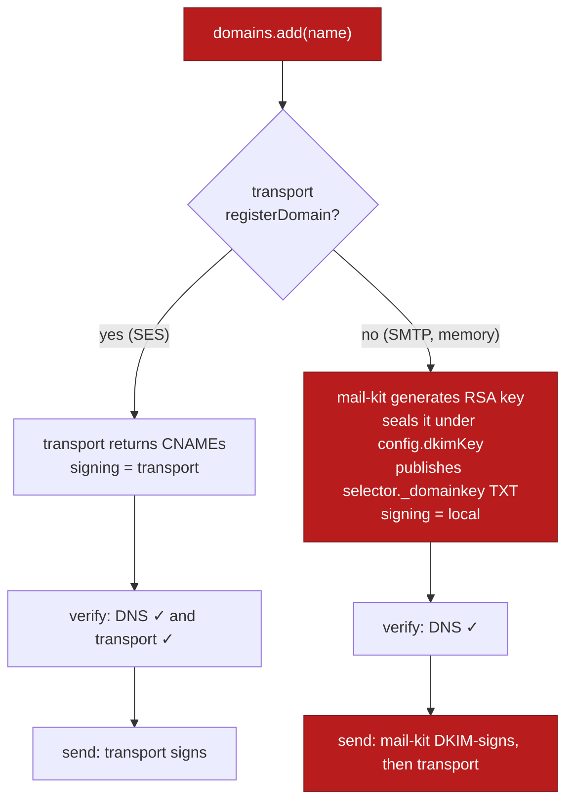
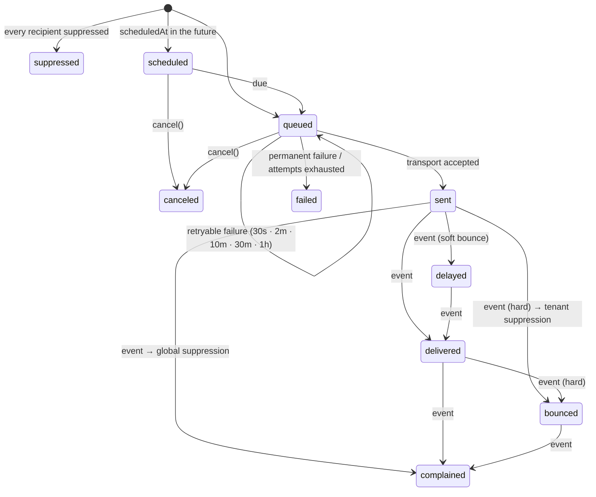
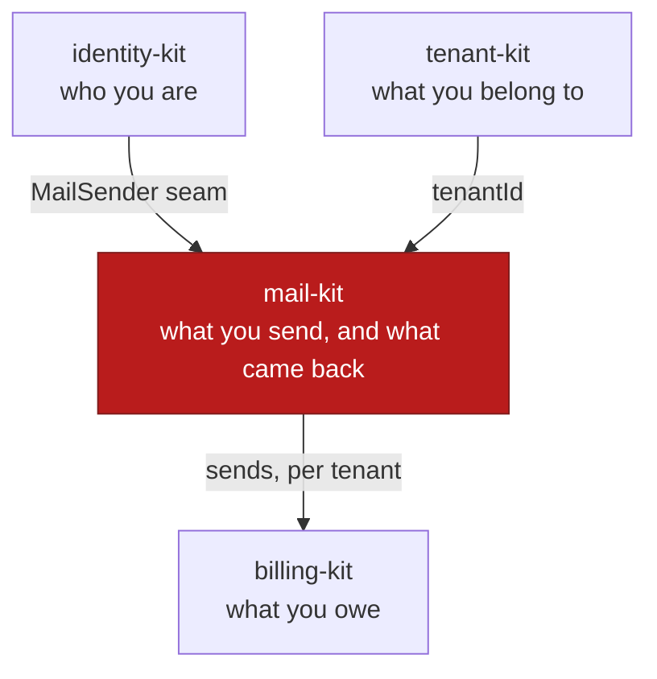

# mail-kit — diagrams

The mermaid sources for this repo. They live here rather than in the
README because npm renders no mermaid: on the package page a fence
like this one ships as raw DSL. GitHub and the QuxKit docs site both
draw them. The README carries an ASCII equivalent of each.

## What mail-kit owns, and the seams it hands out

```mermaid
flowchart LR
    call(["send(tenantId, {from, to, subject, …})"])

    subgraph MK["mail-kit — Apache-2.0"]
        direction TB
        dom["domains<br/>DNS checklist · verify · DKIM key"]
        msg["messages<br/>validate · idempotency · suppression filter<br/>MIME · sign · queue · retry"]
        ev["events<br/>delivered · bounced · complained …"]
        sup["suppression<br/>tenant list + global list + per-list"]
        uns["unsubscribe<br/>HMAC token · RFC 8058 one-click"]
        wh["webhooks<br/>signed · retried · replayable"]
        msg --> dom
        msg --> sup
        msg --> uns
        uns --> sup
        ev --> sup
        ev --> wh
        msg --> wh
        dom --> wh
    end

    subgraph HOST["your app"]
        db[("your database<br/>mail schema")]
        tr["MailTransport<br/>ses · smtp · memory · yours"]
        dns["DnsResolver"]
        http["fetch"]
    end

    call --> msg
    MK -->|SqlExecutor| db
    msg -->|OutboundEnvelope| tr
    tr -.->|DeliveryEvent| ev
    dom --> dns
    wh --> http

    classDef own fill:#b91c1c,stroke:#7f1d1d,color:#ffffff;
    classDef host fill:#1e293b,stroke:#0f172a,color:#e2e8f0;
    class dom,msg,ev,sup,uns,wh own;
    class db,tr,dns,http,call host;
```

## Who signs



## The life of a message



## Where mail-kit sits in the family


